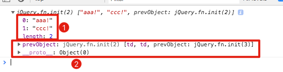
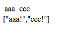

JavaScript JQuery Filter Map Demo
=================================

原来每一个jquery对象都是array-like的，但又不是array：



这就意味着，你可以使用array的某些方法，比如`array[0]`，但是又不能使用一些高级的方法，比如`array.fiilter/map/join`等

Jquery本身也提供了`filter/map`等方法供使用，但是需要注意的是，它的第一个参数是`index`，第二个参数才是item.

如果想使用Array的方法，可以用`jquery.toArray()`把它转换成一个真正的array.

```
open index.html
```


